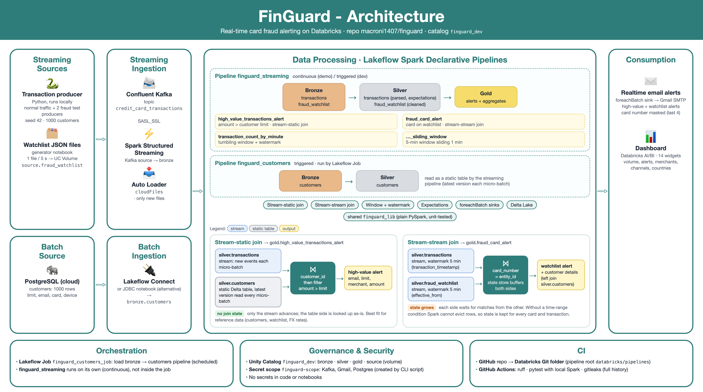

# FinGuard

Real-time credit card fraud alerting on Databricks: a Python simulator publishes transactions to **Kafka (Confluent Cloud)**, **Spark Structured Streaming** pipelines (**Lakeflow Spark Declarative Pipelines**) build **Delta** bronze/silver/gold tables in **Unity Catalog**, join them with customers from **Postgres** and a fraud watchlist fed as **JSON files (Auto Loader)**, and send **email alerts** and a **dashboard**.

## Architecture

[](architecture.png)

<details>
<summary>Text version</summary>

```
LOCAL                                   CLOUD
producer/ (Python) ──► Confluent Kafka ──► bronze.transactions ──► silver.transactions ─┐
                       topic credit_card_transactions                                    │
Postgres customers ──► Lakeflow Connect (or JDBC) ──► bronze.customers ──► silver.customers ─┤
Watchlist JSON files ──► UC Volume ──► Auto Loader ──► bronze.fraud_watchlist ──► silver.fraud_watchlist ─┤
                                                                                           ▼
            gold.high_value_transactions_alert   (amount > customer limit, stream-static join)
            gold.fraud_card_alert                (card on the watchlist)
            gold.transaction_count_by_minute(+_sliding_window)
                    │
                    ├──► email alerts (foreachBatch → Gmail SMTP)
                    └──► Databricks dashboard
            Orchestration: Lakeflow Jobs · Governance: Unity Catalog
```

</details>

## Repository structure

```
├── producer/                         # transaction simulator → Kafka (see producer/README.md)
├── sql/
│   ├── postgres/                     # customers: initial load + incremental change
│   └── databricks/00_setup_unity_catalog.sql
├── scripts/setup_secrets.sh          # Databricks secret scope via CLI (no secrets in notebooks)
├── databricks/
│   ├── pipelines/                    # pipeline root folder
│   │   ├── finguard_lib/             # shared logic: schemas, transforms (plain PySpark), alert emails
│   │   ├── streaming/                # pipeline "finguard_streaming": bronze, silver, gold, alerts
│   │   └── customers/                # pipeline "finguard_customers": silver customers
│   ├── notebooks/                    # connection tests, JDBC customers loader (alternative)
│   └── watchlist_generator/          # writes one watchlist JSON file every few seconds
├── dashboard/finguard_monitoring.lvdash.json
├── tests/                            # pytest + local Spark for finguard_lib
└── .github/workflows/ci.yml          # ruff, pytest, gitleaks
```

Pipeline files only read inputs and call functions in `finguard_lib`, so the logic is tested locally and can be reused outside Lakeflow.

## Setup

### Prerequisites
- Confluent Cloud account (cluster, topic `credit_card_transactions`, API key)
- Databricks workspace with Unity Catalog; check that your plan supports Lakeflow pipelines with streaming, outbound Kafka, Lakeflow Connect for PostgreSQL (or use the JDBC notebook), dashboards and jobs
- A Postgres database reachable from Databricks
- Gmail with an App Password (only for email alerts)
- Databricks CLI, Python 3.10+

### 1. Kafka and the producer
```bash
cd producer
python -m venv .venv && source .venv/bin/activate
pip install -r requirements.txt
cp .env.example .env            # Confluent values; keep TOTAL_CUSTOMERS=1000, RANDOM_SEED=42
python producer_normal.py       # continuous background traffic
```

### 2. Unity Catalog objects
Run `sql/databricks/00_setup_unity_catalog.sql` in the Databricks SQL editor (catalog `finguard_dev`, schemas `bronze`, `silver`, `gold`, `source`, volume `source.fraud_watchlist`).

### 3. Secrets
```bash
databricks auth login --host https://<your-workspace>
set -a; source producer/.env; set +a
export GMAIL_APP_PASSWORD=...          # optional, for email alerts
./scripts/setup_secrets.sh             # scope finguard-scope: kafka_connection_details, gmail_api_key
```
`notebooks/01_kafka_connection_test.py` checks that Databricks can read the topic.

### 4. Customers (Postgres → bronze → silver)
1. Replace the placeholder `alerts@example.com` in `sql/postgres/*.sql` with your inbox, then run `customers_historic.sql` on Postgres.
2. Ingest the `customers` table into `finguard_dev.bronze.customers` with **Lakeflow Connect**, or with `notebooks/04_load_customers_jdbc.py` (secret `postgres_connection_details`, see `scripts/setup_secrets.sh`).
3. Create pipeline **finguard_customers**: root folder `databricks/pipelines`, source `customers/**`, default catalog `finguard_dev`. Run it.

### 5. Watchlist files
Upload `databricks/watchlist_generator/` to the workspace and run the notebook: it writes one JSON file per watchlist entry into `/Volumes/finguard_dev/source/fraud_watchlist/source_data/` (widget `delay_seconds`, default 5). Re-running resumes after the last written entry.

### 6. Streaming pipeline
Create pipeline **finguard_streaming**: root folder `databricks/pipelines`, source `streaming/**`, default catalog `finguard_dev`.
- Configuration key `finguard.email_from` = your Gmail address (needed for email alerts).
- Use **triggered** mode while developing, continuous for demos.

`finguard_lib` is imported from the pipeline root folder. If your workspace does not add the root folder to the Python path, add it in the pipeline settings (or append it to `sys.path` at the top of the pipeline files).

### 7. Trigger alerts
```bash
python producer/producer_fraud_transaction.py   # amount ≥ 100,001 → gold.high_value_transactions_alert + email
python producer/producer_fraud_card.py          # watchlisted card  → gold.fraud_card_alert + email
```

### 8. Dashboard and orchestration
- Import `dashboard/finguard_monitoring.lvdash.json` (Dashboards → Import), attach a SQL warehouse.
- Lakeflow Job: customers ingestion → `finguard_customers` → `finguard_streaming`.

## Development
```bash
python -m venv .venv && source .venv/bin/activate
pip install -r requirements-dev.txt -r producer/requirements.txt    # needs Java 17+ for local Spark
ruff check .
pytest -q tests
```
